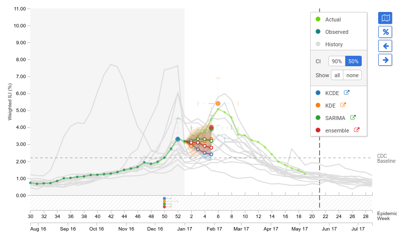
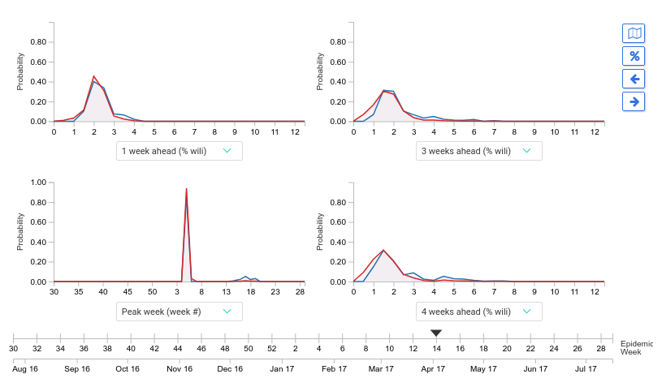

# d3-foresight


[](https://travis-ci.org/reichlab/d3-foresight)
[](https://www.npmjs.com/package/d3-foresight)
[](https://www.npmjs.com/package/d3-foresight)
[](https://github.com/reichlab/d3-foresight/issues)

[](https://github.com/feross/standard)


`d3-foresight` is a library for building interactive time series forecast
visualizations. Check out [flusight](http://reichlab.io/flusight) for a demo.

## Development State

The library is being used in [flusight](https://github.com/reichlab/flusight)
and is a bit tuned towards that specific use case as of now. An examples webpage
will be live [here](http://reichlab.io/d3-foresight) once the documentation is
complete.

## Using

`d3-foresight` needs [d3](https://d3js.org/)
and [momentjs](https://momentjs.com/). Include these in your html:

```html
<script src="https://d3js.org/d3.v4.min.js"></script>
<script src="https://cdnjs.cloudflare.com/ajax/libs/moment.js/2.18.1/moment.min.js"></script>

<!-- Get the js file from ./dist/d3-foresight.min.js. The package is also -->
<!-- available in npm -->
<script src="./d3-foresight.min.js"></script>
```

The library provides two type of charts, `TimeChart` and `DistributionChart`.

### 1. TimeChart

This visualizes prediction of time series by some models upto a provided number
of time steps in future at each step of time. Basic usage instruction follows:

```js
let timeChartOptions = {
  pointType: 'mmwr-week'
}

let timeChart = new TimeChart('#target-div', timeChartOptions)
  
// TODO: Description of data
timeChart.plot(data)

// For updating the current position of displayed predictions
timeChart.update(indexToJump)
// Or simply
timeChart.moveForward()
timeChart.moveBackward()
```



### 2. DistributionChart

This visualizes probability distribution of the model outputs.

```js
let distributionChart = new DistributionChart('#target-div')
  
// TODO: Description of data
distributionChart.plot(data)
```




## Hooks

The charts can call user defined hooks when movement events are triggered inside
(e.g. by clicking on movement buttons or clicking on the overlay). To register
your custom functions to be called on these events, you can `addHook` (this
doesn't overwrite already added hooks, so its safe in that sense).

```js
timeChart.addHook('forward-index', () => {
  // This is triggered when an event moved the visualization forward in time
  console.log('chart moved forward')
})

timeChart.addHook('backward-index', () => {
  // This is triggered when an event moved the visualization backward in time
  console.log('chart moved backward')
})

timeChart.addHook('jump-to-index', (index) => {
  // This is triggered when an event moved the visualization to certain discrete `index` in time
  console.log('chart moved to ' + index)
})
```
